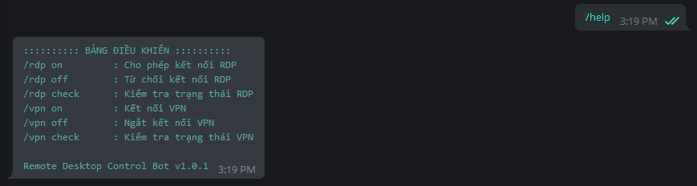
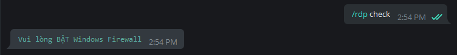
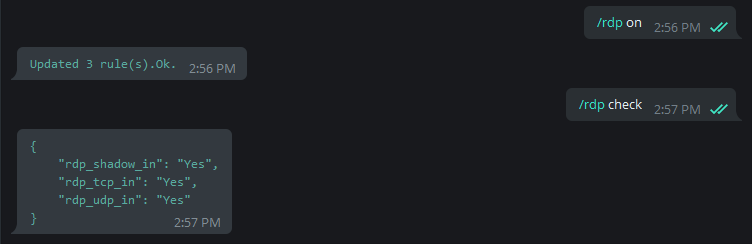
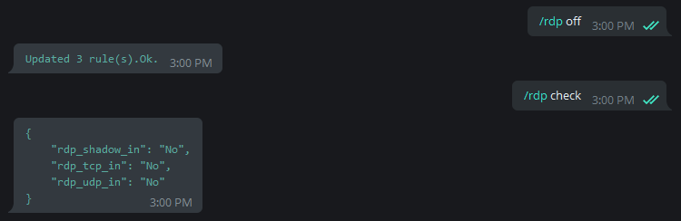
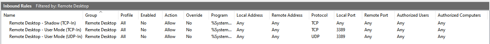
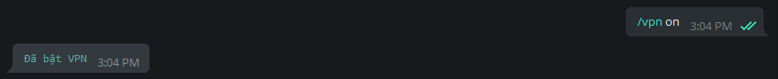
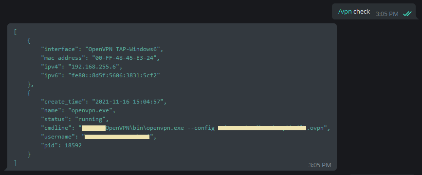
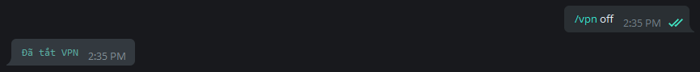

# Remote Desktop Control

To ensure safety during remote access through **Remote Desktop** on Windows OS, We can set up some security configurations such as:

- Set **[STRONG](https://www.lastpass.com/features/password-generator)** password
- Do not use the default Port: **[3389](https://docs.microsoft.com/en-us/windows-server/remote/remote-desktop-services/clients/change-listening-port)**
- 2FA with **[Duo Security](https://duo.com/docs/rdp)**
- Configure the firewall to allow or block connections depending on the time and context
- v.v..

Here I would like to introduce two methods **"not new and less expensive"**, that is to use **Windows Firewall** to control RDP connection. The second way is to connect 2 machines to the same VPN network, only when we have a need to connect RDP to the remote computer will we **ON** to allow the connection. When there is no need to use it anymore, we will **OFF**. This both ensures safety as well as avoids **[Port scanning](https://en.wikipedia.org/wiki/Port_scanner)** by hackers or **[Brute-force](https://en.wikipedia.org/wiki/Brute-force_attack)** attacks password.

Solve this problem, let's go build a **Bot Telegram** will run on the remote computer. Then the home computer or company that wants to RDP in just send a command to the Bot through the Telegram application to **ON** or **OFF**.


## 1. Bot Features

- `/rdp on|off|check`: Managing RDP
- `/vpn on|off|check`: Managing VPN
- Interact via Telegram messaging app

## 2. Use cases

- Remote Desktop to Windows Cloud/VPS Server, etc.
- Work from Home - Access to the company computer
- .v.v.

## 3. How it works

Bot help interface:



### 3.1. Use Windows Firewall to control
To be able to use it, make sure Windows Firewall is enabled on the remote computer:



Allow RDP connections:




RDP connection block:




**Explanation:** By default Windows Firewall has a set of 3 rules to control RDP. When we command the bot On/Off, we are Enable/Disable these rules.




### 3.2. Use VPN to RDP

Connect the destination machine to the VPN Server



Check VPN Status



Disconnect VPN



At the client machine, we also connect to the VPN Server, then both machines will share the same VPN network and can RDP.


## 4. How to build telegram bot

RDC-Bot are written in Python, so it can be difficult to distribute to users. To fix this problem I used the **[PyInstaller](https://www.pyinstaller.org/)** package to packing the application into a single ***.EXE** file that can be run on different Windows computers without having to install Python.

- [rdcbot.py](rdcbot.py): Telegram Bot
- [rdcutil.py](rdcutil.py): Builder

1. Install [Python](https://www.python.org/downloads/windows/)
2. Download or use Git to clone Bot source code:

    ```bash
    $ git clone https://github.com/hailehong95/rdc-bot.git
    ```

3. Install Virtualenv and create virtual environment:

    ```bash
   $ cd rdcbot
   $ pip3 install virtualenv
   $ virtualenv -p python3 venv
   $ venv\Scripts\activate
   $ (venv) pip install -r requirements.txt
    ```

4. Build Bot

   - Optional: Download [UPX Packer](https://upx.github.io/) and put in folder `upx32` or `upx64` respectively inside `packer` folder.

    ```bash
    $ (venv) python rdcutil.py
    ```

5. Result

    - Check the file `rdcbot.exe` in the folder `releases`

## 5. Installation and configuration

Please read: [docs](docs)
