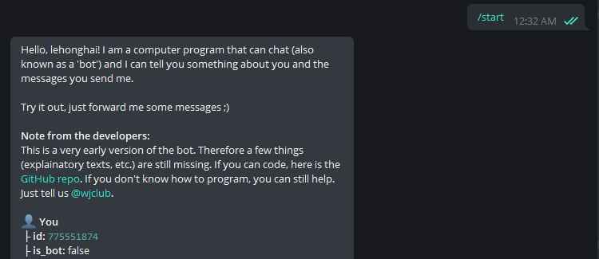

# Cài đặt và cấu hình RDCBot

## 1. Tạo Telegram Bot với BotFather

Chat với **[BotFather](https://t.me/botfather)** và tạo Bot tương tự như các bước sau:


Lưu lại chuỗi Bot token bạn. Ví dụ của tôi là: `1961708813:AAGpCDCx2YeQYWLX5ba8AAlYmhNQtI44qt8`


## 2. Lấy Telegram ChatID với GetIDs Bot

Chat với **[GetIDs Bot](https://t.me/getidsbot)** để lấy Telegram ID của bạn:



Lưu lại chuỗi ChatID của bạn. Ví dụ của tôi là: `775551874`

## 3. Thêm Commands cho Bot

Chat với **[BotFather](https://t.me/botfather)** nội dung: `/mybots`

Chọn Bot mà bạn vừa tạo > Chọn **Edit Bot** > Chọn **Edit Commands** > Nhập nội dung sau hoặc tương tự, tùy bạn:

```
vpn - Quản lý VPN
rdp - Quản lý RDP
help - Trợ giúp
```
Kết quả: Khi chat với Bot bạn chỉ cần nhập `/` để Bot hiển thị các command được hỗ trợ. Khi nhập command bất kỳ bạn chỉ cần nhập một vài ký tự đầu sau đó nhấn phím `Tab`


## 4. Sửa file cấu hình RDCBot

Trên máy tính từ xa cần thiết lập kiểm soát RDP, tạo thư mục và đặt tên bất kỳ sẽ chứa Bot và tệp cấu hình. Bạn cần cấu hình **Windows Defender** exclude thư mục này để tránh nó nhận diện nhầm là virus. Tham khảo cách cấu hình: [Link](https://support.microsoft.com/en-us/windows/add-an-exclusion-to-windows-security-811816c0-4dfd-af4a-47e4-c301afe13b26)

Chép tệp `rdcbot.exe` bạn đã build được bên trong thư mục `releases` và tệp cấu hình mẫu `rdc-bot.conf` tôi cung cấp vào thư mục bạn đã tạo vừa tạo bên trên.


Chỉnh sửa tệp `rdc-bot.conf`. Điền các giá trị Bot token và ChatID phù hợp của bạn đã nhận được ở các bước trước:

```
{
    "bot_token": "0123456789:AAAAAAAAAAAAAAAAAAAAAAA_BBBBBBBBBBB",
    "chat_id": "123456789",
    "openvpn_bin": "path\\to\\openvpn.exe",
    "openvpn_config": "path\\to\\example.ovpn"
}
```

## 5. Cấu hình Bot khởi động lại khi máy tính reboot

Trên máy tính từ xa cần thiết lập kiểm soát RDP, mở **Task Scheduler** sau đó chọn **Create Task..**


Tại Tab **General** đặt tên task và thiết lập một số tùy chọn như hình sau:


Tại Tab **Triggers** thiết lập như sau:


Tại Tab **Action** thiết lập như sau:


Phần **Program/Script**: Bạn cần trỏ đến đường dẫn chứa chương trình Bot bạn đã tạo trước đó.

Bước tiếp theo là xác thực: Bạn cần nhập mật khẩu để toàn tất tạo Task Schedule


Cuối cùng là **Run** Task vừa tạo:


Bây giờ bạn đã có thể Chat với Bot để kiểm soát Bật/Tắt việc cho phép hay không kết nối RDP từ bên ngoài.

Để kiểm tra lần cuối, bạn khởi động lại máy tính. Sau khi khởi động lại, bạn có thể chat với Bot để kiểm chứng RDCBot đã được khởi động ở máy tính từ xa kia.
