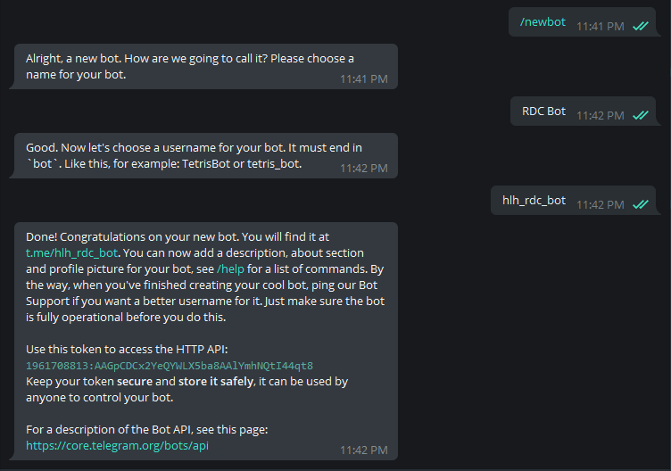

# Install and configure RDC-Bot

## 1. Create Telegram Bot with BotFather

Chat with **[BotFather](https://t.me/botfather)** and create a Bot similar to the following steps:



Save your Bot token. My example is: `1961708813:AAGpCDCx2YeQYWLX5ba8AAlYmhNQtI44qt8`

## 2. Get Telegram ChatID with GetIDs Bot

Chat with **[GetIDsBot](https://t.me/getidsbot)** to get your Telegram ID:


Save your ChatID string. My example is: `775551874`

## 3. Add Commands for Bot

Chat with **[BotFather](https://t.me/botfather)** message: `/mybots`

Select the Bot you just created> **Edit Bot** > **Edit Commands** > Enter the following or something similar, it's up to you:

```
vpn - Quản lý VPN
rdp - Quản lý RDP
help - Trợ giúp
```

When sending a message to the Bot, simply enter `/` to let the Bot display the supported commands.


## 4. Edit RDC-Bot configuration file

On the remote computer, you need to configure **Windows Defender** to exclude the folder containing the RDC-Bot to avoid it being mistakenly identified as a virus. example: [Link](https://support.microsoft.com/en-us/windows/add-an-exclusion-to-windows-security-811816c0-4dfd-af4a-47e4-c301afe13b26)

Copy the `rdcbot.exe` file you built inside the `releases` directory and the sample configuration file `rdc-bot.conf` into the av exclude directory.

Edit the file `rdc-bot.conf`. Fill in the appropriate Bot token and ChatID values:

```
{
    "bot_token": "0123456789:AAAAAAAAAAAAAAAAAAAAAAA_BBBBBBBBBBB",
    "chat_id": "123456789",
    "openvpn_bin": "path\\to\\openvpn.exe",
    "openvpn_config": "path\\to\\example.ovpn"
}
```

## 5. Configure auto-restart bot

On the remote computer that needs to set up RDP control, open **Task Scheduler**  > **Create Task..**


In **General** tab, set task name and set some options:


In **Triggers** tab:


In **Action** tab:


In **Program/Script** section: You need to point to the full path of the RDC-Bot.

The next step is authentication: You need to enter the password to completely create Task Schedule


Finally, **Run** task just created:


Now you can Chat with Bot to control Enable/Disable external RDP connection.

To check a last time, you restart the remote computer. After rebooting, you can chat with the Bot to verify that RDC-Bot has been started on the remote computer.
